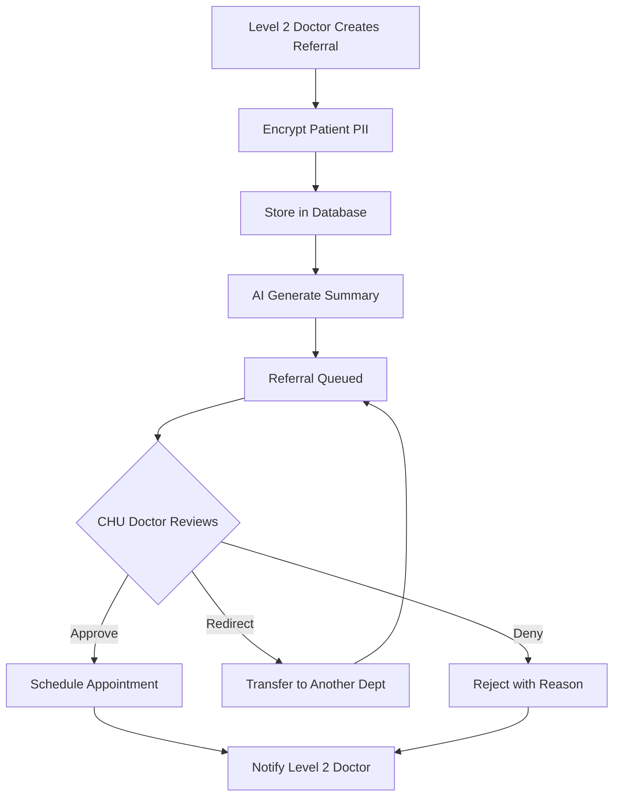
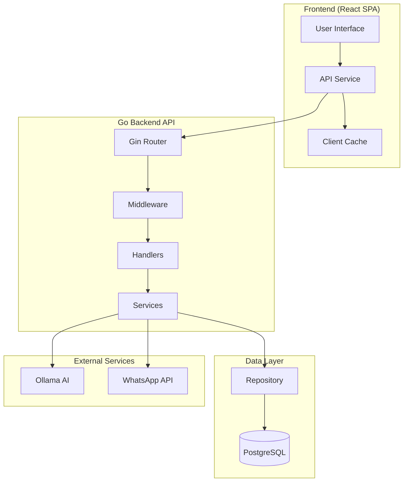
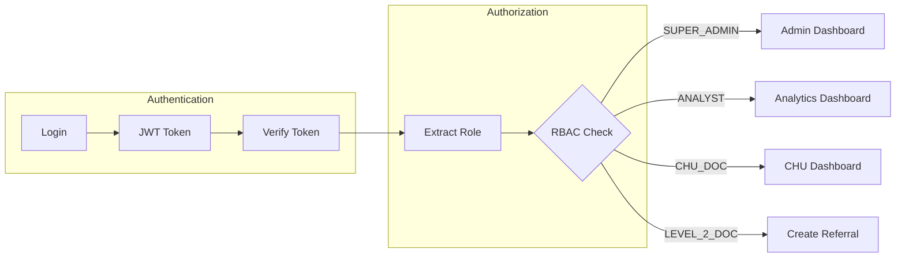

# MedConnect Oriental - Project Structure & Deployment Guide

## Table of Contents

1. [Project Overview](#project-overview)
2. [Features & Functionality](#features--functionality)
3. [Technical Architecture](#technical-architecture)
4. [User Roles & Permissions](#user-roles--permissions)
5. [Security Features](#security-features)
6. [Technology Stack](#technology-stack)
7. [Deployment Guide](#deployment-guide)
8. [Production Deployment](#production-deployment)
9. [Credit](#credit)
---

## Project Overview

**MedConnect Oriental** is a secure medical referral management system designed for healthcare facilities in the Oriental region of Morocco. The platform facilitates the electronic referral of patients from Level 2 healthcare facilities (clinics, local health centers) to CHU (University Hospital Center) specialist departments.

The system addresses critical healthcare challenges by:

- **Digitizing the referral process** - Replacing paper-based referrals with electronic workflows
- **AI-assisted triage** - Using local AI (Ollama) to recommend appropriate specialist departments
- **Data encryption** - Encrypting sensitive patient data (PII) at rest using AES-256-GCM
- **Audit compliance** - Maintaining comprehensive audit logs for Moroccan Law 09-08 compliance
- **Multi-facility support** - Enabling referrals from multiple Level 2 facilities to CHU departments

### Problem Statement

In the Oriental region of Morocco, patient referrals from local clinics to the CHU involve:

- Paper-based documentation that can be lost or delayed
- No standardized triage process
- Difficulty tracking referral status
- Limited visibility into department capacity
- Security concerns for sensitive patient health information

---

## Features & Functionality

### Core Features

#### 1. User Authentication & Authorization

- JWT-based authentication with 24-hour token expiry
- Role-based access control (RBAC) with 4 distinct user roles
- Secure login with rate limiting (10 attempts per minute)
- Session management with automatic token refresh

#### 2. Department Directory

- View all CHU specialist departments
- Display department contact information (phone extensions)
- Show department working hours and accepted referral days
- Real-time availability status (accepting/rejecting referrals)

#### 3. Referral Creation (Level 2 Doctors)

- Create new patient referrals with encrypted PII
- AI-powered department suggestion based on symptoms
- AI-generated symptom summaries for quick review
- File attachment support (PDF, images, documents)
- Urgency level selection (LOW, MEDIUM, HIGH, CRITICAL)

#### 4. Referral Management (CHU Doctors)

- Priority-sorted triage queue by urgency
- Schedule patient appointments
- Redirect referrals to another department
- Deny referrals with reason documentation
- Reschedule or cancel appointments
- View full referral history

#### 5. AI Triage Assistant

- Local AI inference using Ollama (llama3 model)
- Symptom analysis and department recommendation
- Urgency level assessment
- Confidence scoring with reasoning
- Async summary generation (non-blocking)

#### 6. Notifications System

- Real-time notifications for referral status changes
- Mark-as-read functionality
- Notification history tracking

#### 7. Analytics Dashboard (Analysts)

- Department-level statistics
- Doctor-level performance metrics
- Referral volume trends

#### 8. Administration (Super Admins)

- User account management (create, delete)
- Department management (create, update, delete)
- System-wide statistics
- Audit log access

### Referral Workflow



---

## Technical Architecture

### System Architecture



### Project Structure

```
MedConnect/
├── backend/
│   ├── cmd/server/
│   │   └── main.go              # Application entry point
│   ├── internal/
│   │   ├── ai/
│   │   │   └── ai_service.go    # Ollama AI integration
│   │   ├── api/
│   │   │   ├── handlers.go      # HTTP request handlers
│   │   │   ├── dto.go           # Data transfer objects
│   │   │   └── admin_handlers.go
│   │   ├── crypto/
│   │   │   └── aes_gcm.go       # AES-256-GCM encryption
│   │   ├── middleware/
│   │   │   ├── auth.go          # JWT authentication
│   │   │   ├── security_headers.go
│   │   │   ├── rate_limit.go
│   │   │   ├── audit.go         # Audit logging
│   │   │   └── validation.go   # Input validation
│   │   ├── models/
│   │   │   └── models.go       # Database models
│   │   ├── repository/
│   │   │   ├── database.go      # Database connection
│   │   │   └── seeder.go       # Test data seeder
│   │   └── service/
│   │       ├── notification_service.go
│   │       └── whatsapp_service.go
│   ├── go.mod
│   ├── go.sum
│   └── Dockerfile
├── frontend/
│   ├── src/
│   │   ├── App.jsx              # Main application
│   │   ├── components/         # Reusable components
│   │   ├── pages/              # Page components
│   │   │   ├── admin/
│   │   │   ├── analyst/
│   │   │   ├── chu/
│   │   │   ├── level2/
│   │   │   └── shared/
│   │   ├── services/
│   │   │   ├── api.js           # API client
│   │   │   └── cache.js        # Client-side caching
│   │   ├── context/
│   │   │   └── AuthContext.jsx
│   │   └── index.css
│   ├── package.json
│   ├── vite.config.js
│   └── tailwind.config.js
├── docker-compose.yml           # Local development
├── run.sh                      # Development startup script
├── .env.example                # Environment template
└── deployments/
    └── postgres/               # Database initialization
```

---

## User Roles & Permissions

| Role | Description | Permissions |
|------|-------------|-------------|
| `SUPER_ADMIN` | System Administrator | Full system access, user management, department management, audit logs |
| `ANALYST` | Data Analyst | View department and doctor statistics |
| `CHU_DOC` | CHU Specialist Doctor | Manage referral queue, schedule/redirect/deny referrals |
| `LEVEL_2_DOC` | Level 2 Facility Doctor | Create referrals, view own referrals, receive notifications |

### Role-Based Access Control Flow



---

## Security Features

### Data Protection

1. **AES-256-GCM Encryption**
   - Patient PII (CIN, FullName) encrypted at rest
   - Symptoms text encrypted at rest
   - Encryption/decryption at service layer

2. **Password Security**
   - bcrypt password hashing
   - No plaintext password storage

3. **JWT Authentication**
   - 24-hour token expiry
   - Secure signing (HS256)
   - Claims include user ID, role, department

### Network Security

1. **Security Headers**
   - X-Content-Type-Options: nosniff
   - X-Frame-Options: DENY
   - X-XSS-Protection: 1; mode=block
   - Referrer-Policy: strict-origin-when-cross-origin
   - Content Security Policy (CSP)
   - Permissions-Policy restrictions

2. **CORS Configuration**
   - Configurable allowed origins
   - Credential support
   - Proper preflight handling

3. **Rate Limiting**
   - Login endpoint: 10 requests/minute
   - Configurable per-endpoint

### Compliance

1. **Audit Logging**
   - All HTTP requests logged
   - User ID, IP address, timestamp
   - Action details and target IDs
   - Moroccan Law 09-08 compliant

2. **Input Validation**
   - Sanitization of user inputs
   - UUID validation for IDs
   - Request body validation

---

## Technology Stack

### Backend

| Component | Technology | Version |
|-----------|------------|---------|
| Language | Go | 1.22+ |
| Framework | Gin | 1.12.0 |
| Database | PostgreSQL | 15 |
| ORM | GORM | 1.31.1 |
| JWT | golang-jwt | 5.3.1 |
| Encryption | AES-256-GCM | Go stdlib |
| UUID | google/uuid | 1.6.0 |
| AI | Ollama | Latest |

### Frontend

| Component | Technology | Version |
|-----------|------------|---------|
| Framework | React | 18.3.1 |
| Build Tool | Vite | 5.4.0 |
| Routing | react-router-dom | 6.24.1 |
| HTTP Client | axios | 1.7.2 |
| Styling | Tailwind CSS | 3.4.4 |
| Icons | lucide-react | 0.395.0 |

### Infrastructure

| Component | Technology |
|-----------|------------|
| Container | Docker |
| Orchestration | Docker Compose |
| Database | PostgreSQL 15 Alpine |
| AI Inference | Ollama |

---

## Deployment Guide

### Prerequisites

#### Minimum System Requirements

| Component | Minimum | Recommended |
|-----------|---------|-------------|
| CPU | 4 cores | 8+ cores |
| RAM | 8 GB | 16 GB |
| Storage | 50 GB | 100+ GB |
| OS | Ubuntu 20.04+ / macOS | Ubuntu 22.04 LTS |

#### Required Software

- **Docker** 20.10+
- **Docker Compose** 2.0+
- **Git** (for cloning)
- **OpenSSL** (for key generation)

### Environment Variables

Create a `.env` file in the project root:

```bash
# ===========================================
# Database Configuration
# ===========================================
DB_USER=medadmin
DB_PASSWORD=your-secure-password-here

# ===========================================
# Security - CRITICAL
# ===========================================
# Generate with: openssl rand -hex 32
AES_KEY=your-64-character-hex-key

# Generate with: openssl rand -base64 32 (minimum 32 characters)
JWT_SECRET=your-jwt-secret-min-32-chars

# ===========================================
# CORS Configuration
# ===========================================
ALLOWED_ORIGINS=https://your-domain.com,https://www.your-domain.com

# ===========================================
# AI Service (Optional)
# ===========================================
OLLAMA_URL=http://ollama:11434
OLLAMA_MODEL=llama3

# ===========================================
# WhatsApp Integration (Optional)
# ===========================================
WA_URL=http://localhost:8080
WA_TOKEN=your-whatsapp-token
WA_INSTANCE=medconnect
```

### Step-by-Step Deployment

#### Step 1: Clone and Prepare

```bash
# Clone the repository
git clone <repository-url>
cd MedConnect

# Create environment file
cp .env.example .env

# Edit .env with your values
nano .env
```

#### Step 2: Generate Security Keys

```bash
# Generate AES encryption key (64 hex characters = 256 bits)
openssl rand -hex 32
# Output: e.g., a1b2c3d4e5f6... (paste into AES_KEY)

# Generate JWT secret (minimum 32 characters)
openssl rand -base64 32
# Output: e.g., base64string... (paste into JWT_SECRET)
```

#### Step 3: Build and Start Services

```bash
# Using Docker Compose
docker-compose up -d

# Recommended for local development (includes health checks & port detection)
./run.sh

### Troubleshooting Port Conflicts (Postgres)
If you see a warning about port 5432 being in use, you may have a local Postgres instance running. The script will still try to start the Docker container, but it might fail to bind the port. You can stop your local Postgres or change the mapping in `docker-compose.yml`.
```

#### Step 4: Verify Services

```bash
# Check container status
docker-compose ps

# Check backend health
curl http://localhost:3000/api/health

# Check logs
docker-compose logs -f backend
```

### Service Ports

| Service | Port | URL |
|---------|------|-----|
| Frontend (Dev) | 5173 | <http://localhost:5173> |
| Backend API | 3000 | <http://localhost:3000/api> |
| PostgreSQL | 5432 | localhost:5432 |
| Ollama AI | 11434 | <http://localhost:11434> |

---

## Production Deployment

### Production Server Requirements

#### Minimum Deployment Testing Setup (DEMO)

| Component | Specification |
|-----------|---------------|
| Server | VPS or dedicated server |
| CPU | 4 vCPU |
| RAM | 8 GB |
| Storage | 50 GB SSD |
| OS | Ubuntu 22.04 LTS or MacOS |
| Domain | Registered domain name |
| SSL | TLS certificate (Let's Encrypt) |

#### Recommended Production Setup

| Component | Specification |
|-----------|---------------|
| Server | Cloud instance (AWS, GCP, Azure) or dedicated |
| CPU | 16+ vCPU |
| RAM | 32+ GB |
| Storage | 1+ TB NVMe SSD |
| Database | Managed PostgreSQL (RDS, Cloud SQL) |
| CDN | CloudFlare or similar |
| SSL | Wildcard certificate |
| Backup | Automated daily backups |

### Production Checklist (To be implemented on production)

- [ ] Change default database credentials
- [ ] Set strong JWT_SECRET (minimum 32 characters)
- [ ] Configure production domain in ALLOWED_ORIGINS
- [ ] Enable HTTPS/TLS termination
- [ ] Configure firewall rules
- [ ] Set up database backups
- [ ] Configure log rotation
- [ ] Set up monitoring and alerting
- [ ] Configure reverse proxy (nginx)
- [ ] Enable HSTS header

### Production Nginx Configuration (To be implemented on production)

```nginx
server {
    listen 443 ssl http2;
    server_name medconnect.yourdomain.com;

    ssl_certificate /etc/letsencrypt/live/medconnect.yourdomain.com/fullchain.pem;
    ssl_certificate_key /etc/letsencrypt/live/medconnect.yourdomain.com/privkey.pem;

    # Frontend
    location / {
        root /var/www/medconnect/frontend/dist;
        try_files $uri $uri/ /index.html;
    }

    # Backend API
    location /api {
        proxy_pass http://localhost:3000;
        proxy_http_version 1.1;
        proxy_set_header Upgrade $http_upgrade;
        proxy_set_header Connection 'upgrade';
        proxy_set_header Host $host;
        proxy_set_header X-Real-IP $remote_addr;
        proxy_set_header X-Forwarded-For $proxy_add_x_forwarded_for;
        proxy_set_header X-Forwarded-Proto $scheme;
        proxy_cache_bypass $http_upgrade;
    }

    # Enable HSTS
    add_header Strict-Transport-Security "max-age=31536000; includeSubDomains" always;
}

# HTTP to HTTPS redirect
server {
    listen 80;
    server_name medconnect.yourdomain.com;
    return 301 https://$server_name$request_uri;
}
```

### Building Frontend for Production

```bash
cd frontend

# Install dependencies
npm install

# Build for production
npm run build

# Output will be in frontend/dist/
```

### Database Backup Strategy (To be implemented on production)

```bash
# Daily backup script
#!/bin/bash
BACKUP_DIR="/backups/medconnect"
DATE=$(date +%Y%m%d_%H%M%S)

docker exec medconnect_db pg_dump -U medadmin medconnect > "$BACKUP_DIR/medconnect_$DATE.sql"

# Keep only last 30 days
find "$BACKUP_DIR" -name "*.sql" -mtime +30 -delete
```

---

## Security Considerations (To be implemented on production)

### Critical Security Notes (Implemented in the project)

1. **Never commit secrets to version control**
   - Add `.env` to `.gitignore`
   - Use environment variables in production

2. **JWT Secret Requirements**
   - Minimum 32 characters
   - Use cryptographically secure random string
   - Rotate periodically

3. **AES Key Management**
   - 64-character hex string (256 bits)
   - Store securely (secret manager, vault)
   - Never log or expose the key

4. **Input Validation**
   - All user inputs are sanitized
   - SQL injection prevention via GORM
   - XSS prevention via React

5. **Rate Limiting**
   - Login endpoint protected
   - Considering to add more limits in production

### Firewall Configuration (To be implemented on production)

```bash
# Allow SSH
sudo ufw allow 22/tcp

# Allow HTTPS
sudo ufw allow 443/tcp

# Allow HTTP (for Let's Encrypt)
sudo ufw allow 80/tcp

# Enable firewall
sudo ufw enable
```

---

## Troubleshooting

### Common Issues

#### Backend Won't Start

```bash
# Check if ports are in use
lsof -i :3000

# Check logs
docker-compose logs backend

# Verify .env configuration
cat .env
```

#### Database Connection Issues

```bash
# Check PostgreSQL container
docker-compose logs postgres

# Verify database is healthy
docker-compose ps

# Test connection
docker exec -it medconnect_db psql -U medadmin -d medconnect
```

#### AI Features Not Working

```bash
# Check Ollama is running
curl http://localhost:11434/api/tags

# Pull the model if needed
docker exec medconnect_ai ollama pull llama3
```

---

## Support & Maintenance

### Regular Maintenance Tasks

1. **Weekly**
   - Review application logs
   - Check backup integrity
   - Monitor disk space

2. **Monthly**
   - Review and rotate logs
   - Update dependencies
   - Security audit

3. **Quarterly**
   - Security assessment
   - Performance review
   - Disaster recovery test

---

# Credit

This project was realized by [@Ismail Bentour](https://github.com/ibentour) to participate in HackathonAI organized by the Ministry of Digital Transition and Administrative Reform in Ramadan 2026, this hackathon was exceptionally dedicated to innovation in the Oriental region, My team and I won the Regional Grand Prize!

## MedConnect - AI-Powered Medical Platform @2026 ✅
